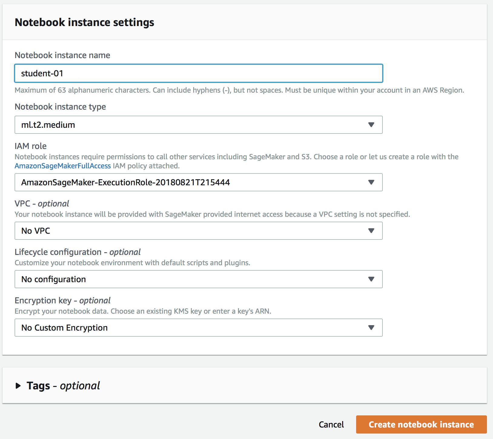
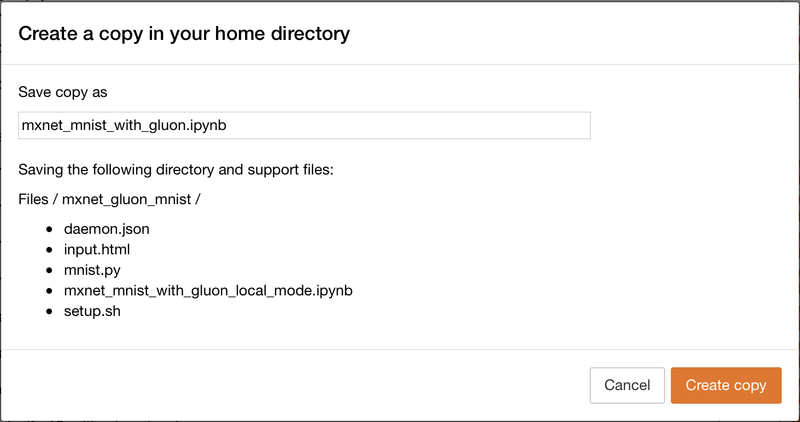
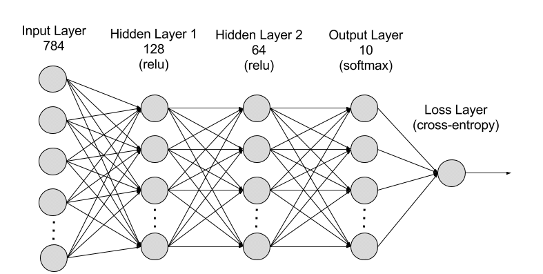
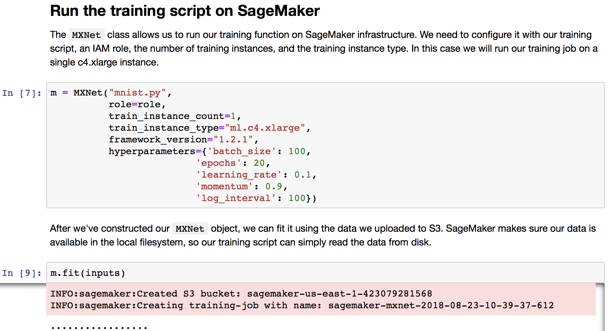
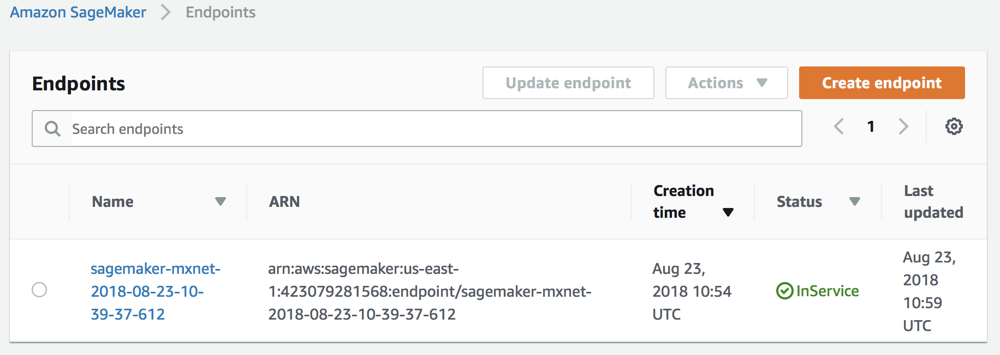

# Lab 2: Introduction to Amazon SageMaker

In this lab, we will be training a machine learning algorithm on the MNIST dataset using MXNet and Gluon.  We will deploy this model, and test it by drawing some hand written digits in the browser.

## Pre-requisite

You have an active AWS account with credits and permissions to run sagemaker jobs.  We will spin up the following resources:

* `ml.t2.medium` notebook instance  
* `ml.c4.xlarge` for training
* `ml.m4.xlarge` for deployment

## Steps

Following is a list of steps for training and deploying a machine learning model with Amazon Sagemaker.

  1. [Create Notebook Instance](#1-create-notebook-instance)
  2. [Launch Sample Notebook](#2-launch-sample-notebook)
  3. [Download dataset](#3-download-dataset)
  4. [Train model](#4-train-model)
  5. [Deploy model](#5-deploy-model)
  6. [Perform Inference](#6-perform-inference)
  7. [Delete Endpoint](#7-delete-endpoint)

### 1. Create Notebook Instance

Open Amazon Sagemker in the AWS console in the `us-east-1` (N. Virginia) region, then click **Create notebook instance** button.

Specify the notebook details

* Name the notebook eg: `student-01`
* For the IAM role select the existing `AmazonSagemaker-ExecutionRole`
* Leave the remaining defaults and click **Create notebook instance**

Your notebook will be pending, once it is ready you can click **open** which will redirect to to your new notebook.

### 2. Launch Sample Notebook

Navigate to the *SageMaker Examples* tab in the Jupyter notebook and expand the *SageMaker Python SDK* to reveal `mxnet_mnist_with_gluon.ipynb` and click **Use** button on the right hand side.

Use default filename and click **Create copy** to launch your new notebook.

### 3. Download dataset

A Jupyter notebook contains markdown content mixed with code with a series of *cells* than can be execute by clicking the Run button, or pressing *shift+enter* keys.

Let's click through the first few cells to download data and upload it to an S3 bucket within your account.  You will see the bucket name appear as output form the cell eg: `sagemaker-us-east-1-423079281568 `

### 4. Train Model

We define MXNet estimator for a multi-layer percetron nerual network architecture.

The `fit` method will train the neural network for 20 `epochs` or training cycles.  For each cycle, the training and validation `loss` will be output to the log.  

The training process should take approximately 5 minutes on a `ml.c4.xlarge` instance.  Once complete you will be able to inspect the job in the Amazon Sagemaker console.

### 5. Deploy Model

With training complete, you can `deploy` your model so that you can predict the most likely digit given a handwritten input.

Run the deploy step and you will get another progress bar which will in the background create a model and an HTTP endpoint.  

This should take approximately 5 miunutes for a `ml.m4.xlarge` endpoint.  In the SageMaker console you will see a *Model* has been created.

Along with an *Endpoint* and its configuration.

### 6. Perform Inference

With you endpoint deployed, execute the cell that renders the `HTML` widget that allows you to draw an *handwritten digit* and capture the output of this `28x28` pixel in a `data` variable.  Note you can hold down the mouse and draw, or click on the widget for individual pixels.

Once you are happy with your drawing, execute the `predict` function to return a response that should hopefully match your handwritten digit.

### 7. Delete Endpoint

Congratulations you have now completed the lab.  Be sure to execute the `delete_endpoint` step to terminate the instance running your ML inference.

